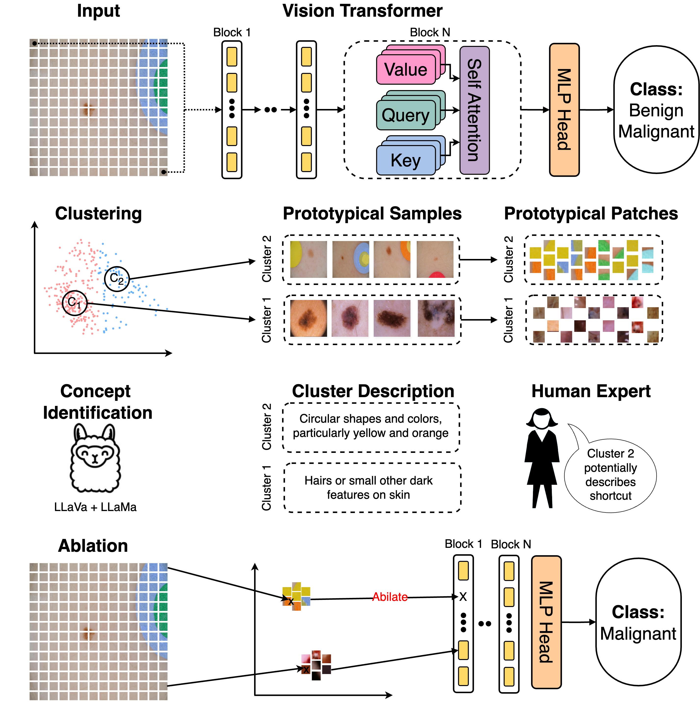

## Efficient Unsupervised Shortcut Learning Detection and Mitigation in Transformers

This is the official code for the paper "[Efficient Unsupervised Shortcut Learning Detection and Mitigation in Transformers](https://arxiv.org/pdf/2501.00942)" by Lukas Kuhn, Sari Sadiya, Joerg Schloetterer, Florian Buettner, Christin Seifert, and Gemma Roig as presented in the International Conference on Computer Vision (ICCV 2025).

The methods is able to identify potential shortcuts and mitigate them during inference time using token ablations. We opted for a Jupyter Notebook approach to make the code more accessible and to provide a more interactive experience, since an important part of our research is the understanding and visiualization of the detected shortcut for better interpretability by a domain expert.

The ISIC dataset used for this example can be downloaded here: [ISIC Dataset](https://challenge.isic-archive.com/data/)


### Method and Code

To install the required packages, please run `pip install -r requirements.txt`. The notebook contains step by step walktrhough of the method for the ISIC example.

Please open an issue and assign to @lukaskuhn-lku for any specific issues.



### Citation

```
@MISC{KuhnSadiya_2024,
  author={{Lukas Kuhn, Sari Sadiya} and Jorg Schlotterer, and Christin Seifert, and Gemma Roig},
  booktitle={CoRR}, 
  title={Efficient Unsupervised Shortcut Learning Detection and Mitigation in Transformers}, 
  year={2024}
}
```

